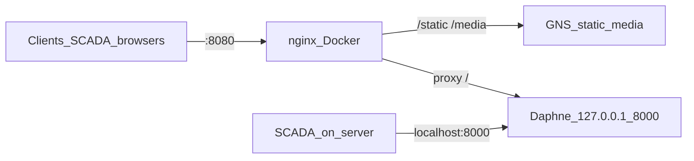

# Deploy: Windows Server (NSSM + uv + nginx in Docker)

Рабочая схема на сервере (`D:\Program Files\PinskGNS`):

- **Daphne / Celery / Celery beat** — NSSM, Python из `.venv` после `uv sync`
- **Postgres, Redis** — на хосте
- **nginx** — Docker Desktop, порт хоста **8080** (внутри контейнера 80)
- Daphne слушает только **`127.0.0.1:8000`**; снаружи вход через nginx



Конфиг и volumes: [docker-compose.nginx.yml](docker-compose.nginx.yml), [nginx/nginx.conf](nginx/nginx.conf).  
Static/media монтируются как `../GNS/static` и `../GNS/media` относительно каталога `deploy/`.

## Доступ

| Кто | URL |
|-----|-----|
| Браузеры / клиенты в сети | `http://gns-gas:8080` или `http://10.10.12.253:8080` |
| Проверка на сервере | `http://gns-gas:8080`, static: `Server: nginx` |
| SCADA (simple-light) на том же хосте | `http://localhost:8000/api/...` |

Имя `gns-gas`: в `hosts` на сервере `127.0.0.1 gns-gas`, на клиентах — IP сервера.

## Обслуживание

Собрать статику после обновления кода:

```powershell
cd "D:\Program Files\PinskGNS"
.\.venv\Scripts\python.exe GNS\manage.py collectstatic --noinput
```

Пересоздать nginx:

```powershell
cd "D:\Program Files\PinskGNS\deploy"
docker compose -f docker-compose.nginx.yml up -d --force-recreate
```

Обновить зависимости:

```powershell
cd "D:\Program Files\PinskGNS"
uv sync
# затем Restart служб django / celery / celery beat в NSSM
```
